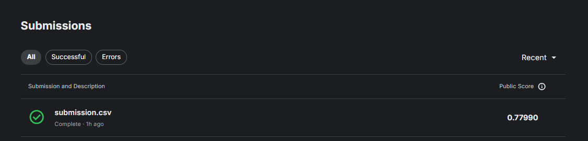

# Titanic Survival Prediction

## Overview
This project predicts passenger survival on the Titanic using machine learning techniques. The dataset is sourced from the [Kaggle Titanic Competition](https://www.kaggle.com/c/titanic) and contains passenger information such as age, gender, class, and fare.  

The goal of this project is to gain practical experience in **preprocessing real-world datasets** and to explore **different strategies for handling various data challenges**.

---

## Features
Key features in the dataset include:

- **PassengerId** – Unique ID for each passenger  
- **Pclass** – Ticket class (1st, 2nd, 3rd)  
- **Name, Sex, Age** – Personal details  
- **SibSp, Parch** – Number of siblings/spouses and parents/children aboard  
- **Ticket, Fare, Cabin, Embarked** – Ticket and travel details  

---

## Methods
- Data cleaning and preprocessing  
- Feature engineering  
- Model selection: Logistic Regression, Random Forest, Gradient Boosting  
- Model evaluation using accuracy, precision, recall, and F1-score  

---

## Results

Here is the model’s performance on the validation set:

Model accuracy: ~78%




## Installation
1. Clone the repository:

```bash
git clone https://github.com/yourusername/Titanic-Survival-Prediction.git
cd Titanic-Survival-Prediction

pip install -r requirements.txt
```
