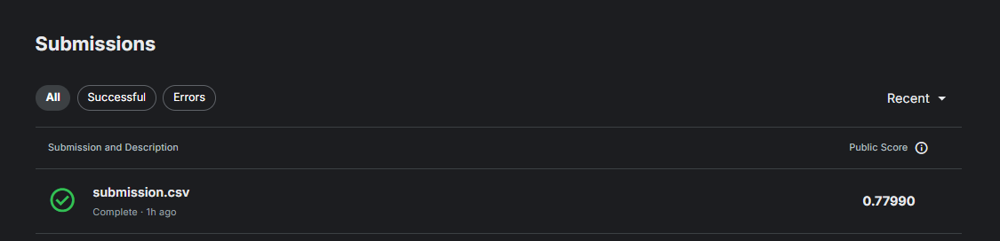

# Titanic Survival Prediction

## Overview
This project predicts passenger survival on the Titanic using machine learning techniques. The dataset is sourced from the [Kaggle Titanic Competition](https://www.kaggle.com/c/titanic) and contains passenger information such as age, gender, class, and fare.  

The goal of this project is to gain practical experience in **preprocessing real-world datasets** and to explore **different strategies for handling various data challenges**.

---

## Features
Key features in the dataset include:
- **PassengerId** – Unique ID for each passenger  
- **Pclass** – Ticket class (1st, 2nd, 3rd)  
- **Name, Sex, Age** – Personal details  
- **SibSp, Parch** – Number of siblings/spouses and parents/children aboard  
- **Ticket, Fare, Cabin, Embarked** – Ticket and travel details  

---

## Methods
- Data cleaning and preprocessing (missing value imputation, outlier analysis)
- Feature engineering (`Title` extracted from Name, `FamilySize` from SibSp + Parch)
- Encoding: Label Encoding for binary columns, One-Hot Encoding for Embarked
- Log transformation on Fare to reduce skewness, Standard Scaling on Age and Fare
- Model: Logistic Regression
- Evaluation using train/validation split (80/20)

---

## Results

| Metric | Score |
|---|---|
| Validation Accuracy | ~78% |
| Kaggle Score | 0.77990 |




---

## Installation
1. Clone the repository:
```bash
git clone https://github.com/SardarAhmed05/Titanic-Survival-Prediction.git
cd Titanic-Survival-Prediction
pip install -r requirements.txt
```
